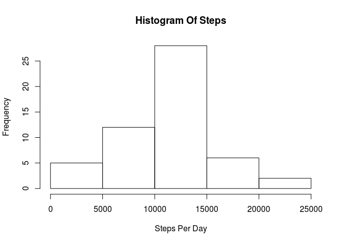
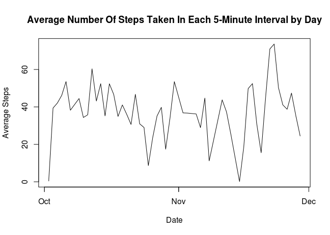
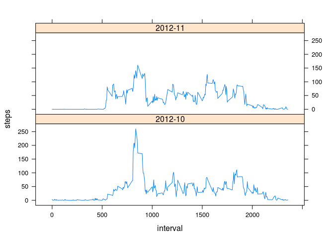
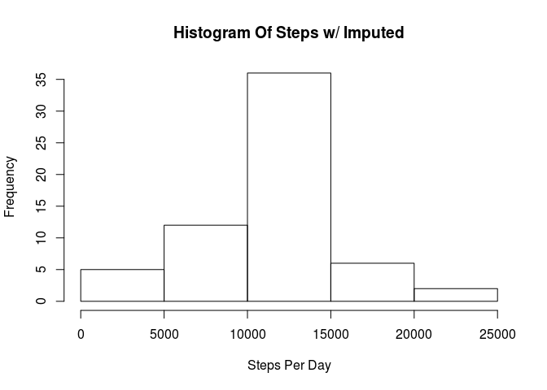
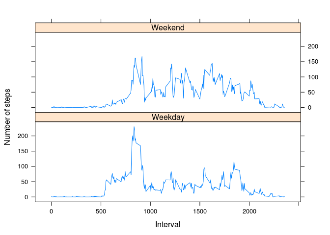

# Reproducible Research: Peer Assessment 1

## Load and clean the data

```r
# Load needed libraries
library(lattice)
# Load Data
full_data = read.csv("activity.csv")
# Add Datetime Data
full_data$datetime = strptime(full_data$date, "%Y-%m-%d")
# Filter To Remove "NA"
clean_data = na.omit(full_data)
```

## Histogram of total number of steps taken each day

```r
sum_steps = aggregate(clean_data$steps, list(date=clean_data$date), sum)
hist(sum_steps$x, xlab = "Steps Per Day", main = "Histogram Of Steps")
```

<!-- -->

## Mean and median of number of steps taken per day

```r
mean(sum_steps$x)
```

```
## [1] 10766.19
```

```r
median(sum_steps$x)
```

```
## [1] 10765
```

## Time series plot of the average number of steps taken

```r
mean_steps = aggregate(clean_data$steps, list(date=clean_data$date), mean)
mean_steps$dateobj = strptime(mean_steps$date, "%Y-%m-%d")
plot(
    x=mean_steps$dateobj, y=mean_steps$x, 
    xlab = "Date", ylab = "Average Steps", type="l", 
    main = "Average Number Of Steps Taken In Each 5-Minute Interval by Day"
)
```

<!-- -->

## The 5-minute interval that, on average, contains the maximum number of steps

```r
mean_intv = aggregate(clean_data$steps, list(interval=clean_data$interval), mean)
max_intv = max(mean_intv$x)
mean_intv[mean_intv$x == max_intv,]$interval
```

```
## [1] 835
```

## Code to describe and show a strategy for imputing missing data
### Missing values

```r
length(full_data[is.na(full_data$steps),]$steps)
```

```
## [1] 2304
```

```r
unique(as.matrix(full_data[is.na(full_data$steps),]$date))
```

```
##      [,1]        
## [1,] "2012-10-01"
## [2,] "2012-10-08"
## [3,] "2012-11-01"
## [4,] "2012-11-04"
## [5,] "2012-11-09"
## [6,] "2012-11-10"
## [7,] "2012-11-14"
## [8,] "2012-11-30"
```
### Comparison of average steps by month

```r
imputeagg = aggregate(
    clean_data$steps,
    list(interval=clean_data$interval, ym=substr(clean_data$date, 1, 7)),
    mean
)
xyplot(x ~ interval | ym, data=imputeagg, layout=c(1,2), type="l", ylab="steps")
```

<!-- -->

### Assign imputed values (by assigning the average interval time)

```r
imputed_data = full_data
imputed_data[is.na(imputed_data$steps),]$steps = as.integer(
    lapply(
        imputed_data[is.na(imputed_data$steps),]$interval,
        function (x) {
            mean_intv[mean_intv$interval == x, ]$x
        }
    )
)
```

## Histogram of the total number of steps taken each day after missing values are imputed

```r
isum_steps = aggregate(imputed_data$steps, list(date=imputed_data$date), sum)
hist(isum_steps$x, xlab = "Steps Per Day", main = "Histogram Of Steps w/ Imputed")
```

<!-- -->

## Mean and median of number of steps taken per day, with imputed data

```r
mean(isum_steps$x)
```

```
## [1] 10749.77
```

```r
median(isum_steps$x)
```

```
## [1] 10641
```

Note that the mean of daily steps remains nearly the same, but the median moves down somewhat. This may indicate that the data that were left out of the "clean" data were on the lower side in terms of number of steps. This seems to make sense since the data by month is lower for November, which is where more of the missing data are found.

## Panel plot comparing the average number of steps taken per 5-minute interval across weekdays and weekends

```r
weekpart = function(days) {
    ret = c();
    for (day in days) {
        if (day %in% c("Saturday","Sunday")) { ret = c(ret, "Weekend") }
        else { ret = c(ret, "Weekday") }
    }
    return(ret)
}

imputed_data$wk = weekpart(weekdays(as.Date(imputed_data$date)))
weekpart = aggregate(
    imputed_data$steps,
    list(weekpart=imputed_data$wk, interval=imputed_data$interval),
    mean
)
xyplot(
    x ~ interval| weekpart, data=weekpart, 
    layout=c(1,2), type="l", xlab="Interval", ylab="Number of steps"
)
```

<!-- -->
